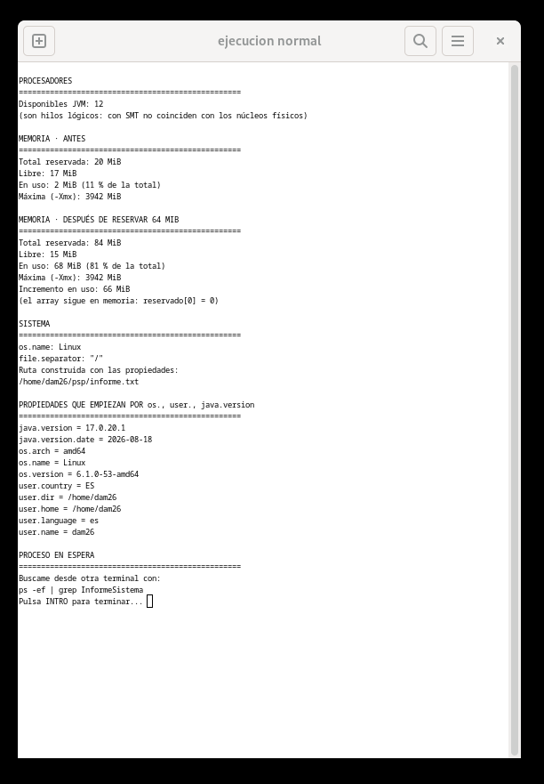
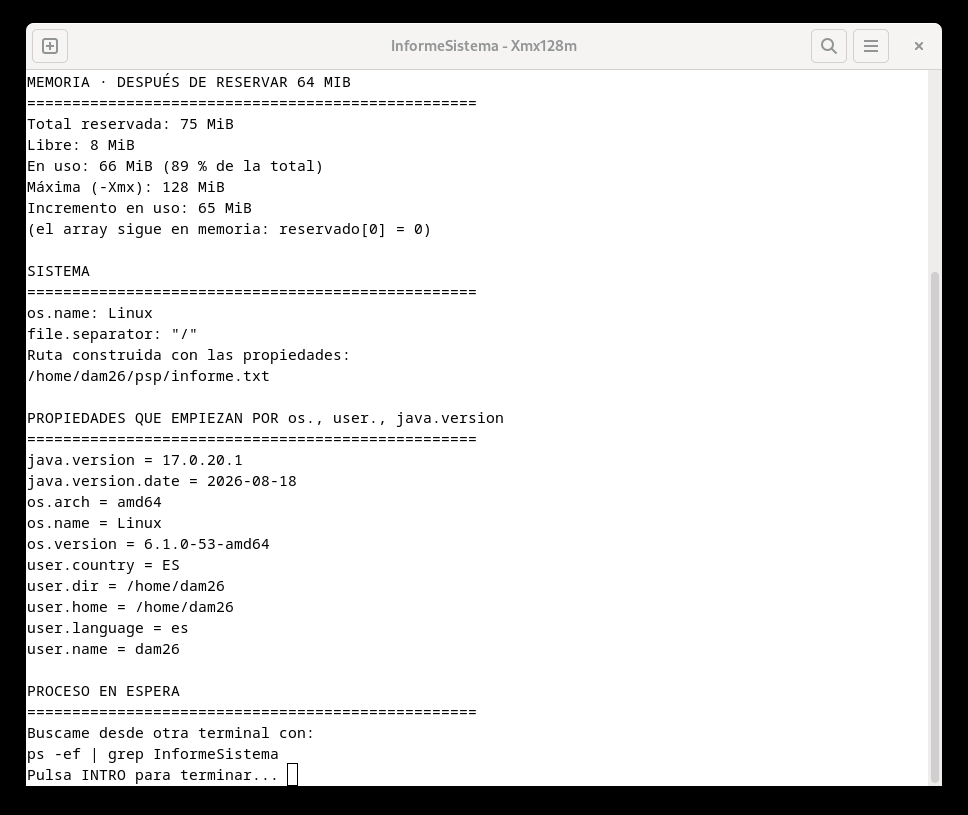
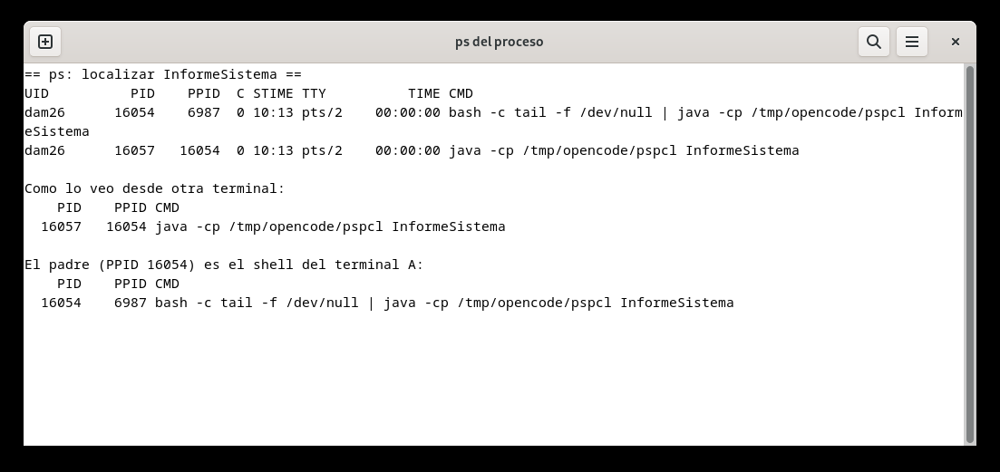
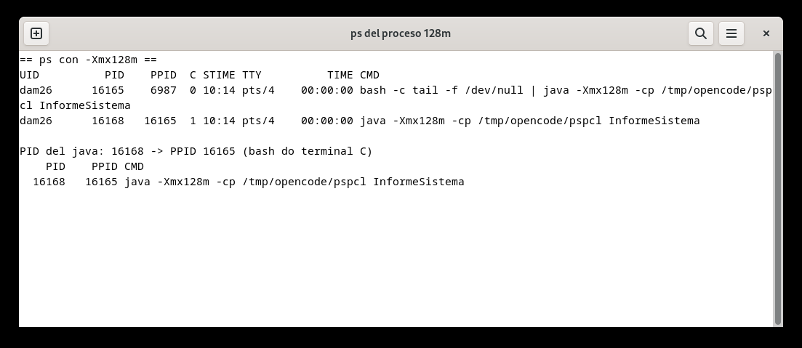

# Tarea 1 - Radiografía del sistema

Antuan Herrera Icaza · CFGS DAM2 · CPR Daniel Castelao · curso 2026-2027

## El programa

Hice una clase `InformeSistema` que cuando se ejecuta imprime por pantalla un montón de datos del sistema. Lo que hace, resumido:

- Dice los **procesadores** que ve la JVM (con `Runtime.availableProcessors()`).
- **Memoria en MiB**: total reservada, libre, en uso y máxima, con el porcentaje de memoria en uso sobre el total. La muestra antes y después de reservar 64 MiB.
- Para reservar los 64 MiB uso `long[] reservado = new long[8 * 1024 * 1024];` (8 millones de long × 8 bytes = 64 MiB). El array lo guardo en una variable y después de la segunda medición imprimo `reservado[0]`, porque si no, el recolector de basura lo puede liberar antes de que mida y el incremento me saldría 0 sin ningún error.
- **Multiplataforma**: saca el sistema operativo, el separador de rutas y la ruta a `informe.txt` dentro de una carpeta `psp` en mi carpeta personal. Todo esto lo cojo de las propiedades del sistema (`os.name`, `file.separator` y `user.home`), sin escribir a mano ni un separador ni una ruta absoluta.
- **Propiedades del sistema**: las que empiecen por los prefijos que le pase por línea de comandos. Si no le paso ninguno, usa `os.`, `user.` y `java.version`, y las imprime ordenadas alfabéticamente.
- Al final se queda **esperando**: muestra "Pulsa INTRO para terminar..." y espera con un `Scanner` sobre `System.in`, para que dé tiempo a localizarlo desde fuera mientras sigue en ejecución.

## Las dos ejecuciones

Primero lo ejecuté normal:



Y después con `-Xmx128m` para ver cómo cambia la memoria:



## Buscarlo desde fuera con ps

Con el programa parado en la espera, abrí otra terminal y lo busqué:

```
ps -ef | grep InformeSistema
```

Captura:



Sale el proceso `java ... InformeSistema` con **PID 16057** y **PPID 16054**. El proceso padre es el **bash** del terminal, que es lo normal: cuando escribes `java InformeSistema` en una terminal, el shell es quien crea el proceso del programa y por tanto es su padre.

También hay que repetir la prueba desde el IDE (IntelliJ). En esa ejecución el PPID ya no será el shell del terminal: el proceso que lance el IDE será el padre del programa. Por eso el PPID cambia según desde dónde se lance (terminal → bash; IDE → proceso del IDE o su lanzador).

> Pendiente antes de entregar: ejecutar desde IntelliJ, localizar el proceso mientras espera y guardar/añadir la captura como `capturas/ps_ide.png`. No se debe afirmar que existe esa captura hasta haberla añadido.

Y repetí la búsqueda mientras ejecutaba con `-Xmx128m`:



Otra vez el padre es el shell del terminal; el PID cambia en cada ejecución, pero eso es normal.

### La memoria, antes y después

Estos son los números que salen:

| Cifra | Ejecución normal | Con -Xmx128m |
|---|---|---|
| Total reservada | antes 20 MiB · después 84 MiB | antes 10 MiB · después 74 MiB |
| Libre | antes 17 MiB · después 15 MiB | antes 8 MiB · después 7 MiB |
| En uso | antes 2 MiB (11 %) · después 68 MiB (81 %) | antes 1 MiB (11 %) · después 66 MiB (90 %) |
| Máxima (-Xmx) | 3942 MiB | 128 MiB |

Lo que veo:

- **La máxima** es la única que cambia directamente por el comando: con `-Xmx128m` la JVM tiene el tope en 128 MiB y sin él me deja llegar hasta 3942 MiB.
- **La total reservada** también cambia: sin `-Xmx` la JVM reserva 20 MiB al arrancar; con un máximo tan pequeño no reserva tanto al principio (10 MiB) para no quedarse tan justa. Cuando reservo el array, el heap va creciendo para poder alojarlo (84 y 74 MiB).
- **La libre** baja siempre después de la reserva, porque el array ocupa sitio.
- **La de uso** sube de 2 a 68 (y de 1 a 66), es decir el incremento es más o menos lo que reservé (64 MiB) más un pelín de overhead de la JVM.
- El **porcentaje en uso sobre el total** se nota mucho más con `-Xmx128m` (90 % frente al 81 %): 64 MiB pesan mucho más en un heap de 74 MiB que en uno de 84.

La cifra que no cambia apenas es el **incremento** (66 y 65 MiB), porque en los dos casos reservo lo mismo.

### La ruta multiplataforma

En mi máquina (Linux) el programa genera:

```
/home/dam26/psp/informe.txt
```

En Windows habría generado algo así:

```
C:\Users\dam26\psp\informe.txt
```

La diferencia está en las propiedades del sistema: `user.home` vale `/home/dam26` en Linux y `C:\Users\dam26` en Windows, y `file.separator` es `/` o `\`. Como la ruta se construye siempre con esas propiedades y ninguna parte está escrita a mano, el mismo código vale para los dos.

## Apartado 3: qué programación encaja en cada caso

**a) Un servidor web que atiende 500 peticiones a la vez en una máquina de 8 núcleos.**

Programación **concurrente**, y también un poco de paralela a nivel de hilos.

Por qué: son 500 peticiones simultáneas y solo 8 núcleos: no se pueden hacer 500 cosas a la vez, así que se van intercalando en el tiempo (el servidor va atendiendo unas y otras; normalmente reparte el trabajo en un pool de hilos). En paralelo actúa cuando en un momento dado hay más de un núcleo libre y varias peticiones listas, que se ejecutan de verdad a la vez.

Inconveniente concreto: si metes un hilo por petición, cada hilo se come su memoria de pila y el cambio de contexto empieza a quitar rendimiento; además, todos comparten datos del servidor y hay que protegerlos con sincronización, que si se hace mal provoca condiciones de carrera.

**b) Renderizar una película de animación en tres meses.**

Programación **paralela**, y distribuida si se usan varias máquinas.

Por qué: un render se puede cortar en trozos independientes (frames o zonas del frame), así que en una máquina con muchos núcleos cada núcleo va calculando uno a la vez y el tiempo total baja. Si en vez de una máquina usan una granja de render, entonces además es **distribuida**, porque trabajan varias máquinas conectadas por red como si fueran una.

Inconveniente concreto: no escala el 100 %, porque siempre hay una parte que no se puede dividir (planificar, escribir los frames, sincronizar) que marca el límite (la ley de Amdahl). En el caso distribuido se suman el coste de las máquinas y los fallos de la red.

**c) Una app de móvil que descarga un fichero mientras sigues navegando.**

Programación **concurrente**.

Por qué: son dos tareas del mismo dispositivo que coexisten en el tiempo: la descarga va en un hilo de fondo mientras el hilo principal sigue atendiendo la interfaz. No se busca acabar antes, sino que la app siga respondiendo mientras otra cosa avanza; se van intercalando las instrucciones.

Inconveniente concreto: los dos hilos comparten datos (el fichero que se está bajando, el progreso...) y si no los sincronizas bien te salen condiciones de carrera; además, procesos en segundo plano gastan batería.

**d) Un cálculo que no cabe en la RAM de un solo equipo.**

Programación **distribuida**.

Por qué: los datos no entran en la memoria de una máquina, así que no sirve de nada repartir los hilos entre núcleos de un mismo equipo: te quedas sin RAM igualmente. Los datos hay que repartirlos entre varias máquinas conectadas por red, cada una con su memoria, que se comunican por mensajes y trabajan como una sola.

Inconveniente concreto: la comunicación por red añade latencia y hay que aguantar que un nodo pueda fallar, y si el problema no está bien dividido, mover los datos entre nodos puede costar más que calcular.

## Estructura

```
├── README.md
├── src/InformeSistema.java
└── capturas/
```
