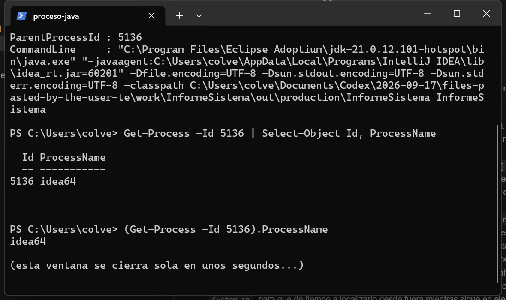
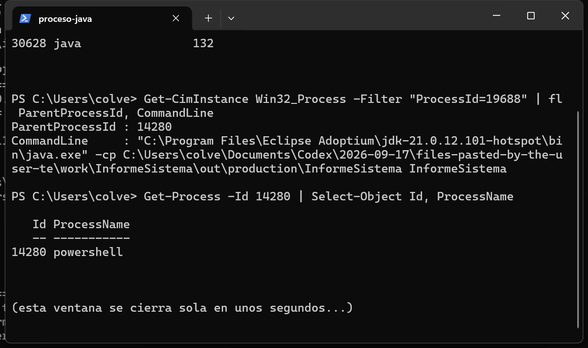

# Tarea 1 - Radiografía del sistema

Antuan Herrera Icaza ·DAM2 · CPR Daniel Castelao · curso 2026-2027

## El programa

He hecho una clase `InformeSistema` que cuando se ejecuta imprime en pantalla un montón de datos del sistema. Hace esto:

- Cuenta los procesadores que ve la JVM (`Runtime.availableProcessors()`).
- Mide la memoria en MiB (total reservada, libre, en uso y máxima, con su porcentaje) antes y después de reservar 64 MiB.
- Los 64 MiB los reservo con `long[] reservado = new long[8 * 1024 * 1024];` (8 millones de long × 8 bytes = 64 MiB). Después de la segunda medición imprimo `reservado[0]` para que el recolector de basura no retire el array antes de tiempo; la primera vez que lo probé sin eso el incremento me salía 0 y no sabía por qué.
- Detecta el sistema operativo y, con las propiedades `os.name`, `file.separator` y `user.home`, arma la ruta de un `informe.txt` dentro de una carpeta `psp` en mi carpeta personal. Nada de rutas escritas a mano.
- Imprime las propiedades que empiecen por los prefijos que le paso por línea de comandos; si no le paso ninguno, usa `os.`, `user.` y `java.version`, y las ordena alfabéticamente.
- Al final se queda esperando a que pulse INTRO (con un `Scanner`), para que mientras tanto lo pueda localizar desde otra ventana.

Esta es la salida de una ejecución normal, tal cual:

```
PROCESADORES
Disponibles JVM: 16
(son hilos logicos: con SMT no coinciden con los nucleos fisicos)

MEMORIA - ANTES
Total reservada: 254 MiB
Libre: 250 MiB
En uso: 3 MiB (1 % de la total)
Maxima (-Xmx): 4056 MiB

MEMORIA - DESPUES DE RESERVAR 64 MIB
Total reservada: 254 MiB
Libre: 184 MiB
En uso: 69 MiB (27 % de la total)
Maxima (-Xmx): 4056 MiB
Incremento en uso: 66 MiB
(el array sigue en memoria: reservado[0] = 0)

SISTEMA
os.name: Windows 11
file.separator: "\"
Ruta construida con las propiedades:
C:\Users\colve\psp\informe.txt

PROPIEDADES QUE EMPIEZAN POR os. user. java.version
java.version = 21.0.12.1
java.version.date = 2026-08-18
os.arch = amd64
os.name = Windows 11
os.version = 10.0
user.country = ES
user.dir = C:\Users\colve
user.home = C:\Users\colve
user.language = es
user.name = colve
user.script =
user.variant =

PROCESO EN ESPERA
Buscame desde otra terminal con:
ps -ef | grep InformeSistema
Pulsa INTRO para terminar...
Fin del programa.
```

## Las dos ejecuciones

Primero lo ejecuté normal, desde IntelliJ con la configuración por defecto:


Y después con la memoria limitada. Me hice una configuración de ejecución llamada `InformeSistema128m` en IntelliJ con la opción de VM `-Xmx128m` y la lancé lo mismo:


Las dos se quedan esperando en "Pulsa INTRO para terminar...", que es lo que se ve al final de las capturas.

## El proceso, desde fuera

En Windows no hay `ps` ni `grep`, así que lo busqué con PowerShell:

```
Get-CimInstance Win32_Process -Filter "Name='java.exe'" | Where-Object { $_.CommandLine -match 'InformeSistema' }
```

y con `Get-Process -Id <pid>` sobre el PID que salía como padre para ver quién había lanzado el proceso.

Con el programa en espera y ejecutándolo desde IntelliJ, esto es lo que sale:



El proceso era el PID 26768 y el padre el PID 5136, `idea64`, o sea IntelliJ. Tiene lógica: cuando pulso Run, es IntelliJ el que crea el proceso `java` con mi clase, por eso el padre es suyo. En la línea de comandos no hay ningún `-Xmx`, va con lo que la JVM decide por defecto (4056 MiB).

Con la configuración `-Xmx128m`, también desde el IDE:


El PID era 17700 (cambia en cada ejecución, cada vez es un proceso nuevo) y el padre otra vez el 5136 (`idea64`), porque también lo creó IntelliJ. Aquí sí se ve el `-Xmx128m` en la línea de comandos.

Y lanzándolo directamente desde PowerShell, sin tocar el IDE:



El PID era 19688 y el padre el 14280, que es `powershell`, la ventana de donde escribí el comando.

Así que el PPID sí cambia según desde dónde se lance: si lo lanza el IDE el padre es `idea64`, y si lo lanza una terminal el padre es esa terminal. El PID cambia siempre porque es un proceso distinto cada vez.

## Los números de la memoria

Comparando las dos ejecuciones:

| | Normal | Con -Xmx128m |
|---|---|---|
| Total reservada (antes → después) | 254 → 254 MiB | 128 → 128 MiB |
| Libre (antes → después) | 250 → 184 MiB | 125 → 61 MiB |
| En uso (antes → después) | 3 MiB (1 %) → 69 MiB (27 %) | 2 MiB (2 %) → 66 MiB (52 %) |
| Máxima (-Xmx) | 4056 MiB | 128 MiB |
| Incremento en uso | 66 MiB | 63 MiB |

Lo que cambia es la **máxima**: con `-Xmx128m` le digo a la JVM que como mucho reserve 128 MiB, y sin la opción la máxima la pone ella (4056 MiB). La **total reservada** baja también (254 → 128) porque con el tope en 128 la JVM no puede reservar más. La **libre** y la de **en uso** cambian por lo mismo y porque el array de 64 MiB ocupa sitio. El porcentaje sube mucho más con 128 MiB: el mismo array de 64 MiB es el 52 % de un heap de 128 y solo el 27 % de uno de 254. El **incremento** sale parecido (66 y 63 MiB) porque en los dos casos reservo lo mismo; la diferencia de un par de megas es lo que la JVM gasta en sus cosas al arrancar.

## La ruta multiplataforma

En mi equipo el programa saca esta ruta:

```
C:\Users\colve\psp\informe.txt
```

En Linux sacaría esta:

```
/home/colve/psp/informe.txt
```

No la he podido probar en Linux porque en casa solo tengo Windows, pero en el código no hay ninguna ruta escrita a mano: se monta con `user.home` (aquí `C:\Users\colve`, en Linux `/home/colve`) y con `file.separator` (`\` o `/`), así que la misma clase genera la ruta que toca en cada sistema.

## Apartado 3

**a) Un servidor web que atiende 500 peticiones a la vez en una máquina de 8 núcleos.**

Va con programación **concurrente** (y algo de paralela cuando hay núcleos libres). Son 500 peticiones y solo 8 núcleos, así que no se atienden todas de verdad a la vez: se van intercalando, cada petición es una tarea que casi siempre está esperando a la red o a la base de datos. El inconveniente es que esos hilos comparten datos del servidor y hay que sincronizar el acceso, que es de donde salen las condiciones de carrera.

**b) Renderizar una película de animación en un plazo de tres meses.**

Programación **paralela** (y **distribuida** si se usan varias máquinas). Un render se puede trocear en frames, así que en una máquina con varios núcleos cada núcleo puede calcular uno a la vez y el tiempo total baja. Las productoras usan granjas de servidores y ahí ya es distribuido. El inconveniente: siempre hay una parte que no se puede repartir (organizar las tareas, juntar el resultado), y eso limita lo que se gana; en el caso distribuido se suman los fallos de red y el coste de las máquinas.

**c) Una app de móvil que descarga un fichero mientras sigues navegando.**

Programación **concurrente**. Son dos tareas del mismo móvil que coexisten: la descarga va en un hilo de fondo mientras la interfaz sigue respondiendo; las instrucciones de las dos se van intercalando. El objetivo no es acabar antes, es que la app no se quede bloqueada. El inconveniente: hay que coordinar los dos hilos para compartir bien los datos (el fichero, el progreso) y un proceso en segundo plano gasta más batería.

**d) Un cálculo que no cabe en la RAM de un solo equipo.**

Programación **distribuida**. Si los datos no caben en la memoria de una máquina, no sirve de nada repartir hilos entre los núcleos del mismo equipo: te sigues quedando sin RAM. Los datos se reparten entre varias máquinas conectadas por red, cada una con su memoria, que se comunican por mensajes. El inconveniente: la red es mucho más lenta que la memoria local, así que hay que dividir bien el problema para que los nodos no se estén pasando datos todo el rato, y además asumir que algún nodo puede fallar.

## Estructura

```
README.md
src/InformeSistema.java
capturas/
```